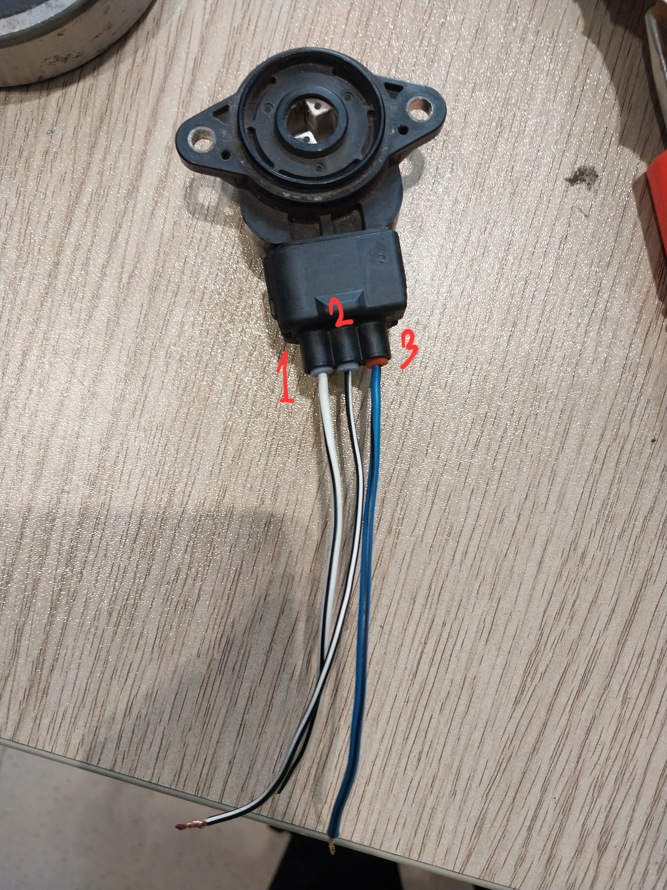

## Used a Throttle Position Sensor (TPS)
> 15/03/2025

### Circuit


Like a regular potentiometer, TPS is also a variable resistor. The image above shows the three terminals. Terminal 1 & 3 are for power and GND. The polarity does not matter. Terminal 2 is the wiper terminal. This one has a varying resistance. The resistance between Terminal 1 & 2 is around 7.5kΩ. And the resistance between the wiper and the two terminals vary between this range. 
- Terminal 1 (TPS) > 5V (Arduino)
- Terminal 2 (TPS) > Analog pin (Arduino)
- Terminal 3 (TPS) > GND (Arduino)

### Code explanation
There is nothing to explain, really. The code is just a basic analog voltage reading.
```cpp
  Serial.print("Min:0,");
  Serial.print("Value:"+String(v)+",");
  Serial.println("Max:1023");
```
This part is used to show the value to the Serial Plotter along with the minimum and maximum range of the analog reading an Arduino can get (0 and 1023).

### Usable?
This sensor does not have a gradual increase in resistance across the rotational range of the knob. It starts to change slowly, but at some point has a rapid change. It has more of an exponential increase (or decrease dependin on the polarity) in value based on the rotation of the knob. So it is not usable for our purpose.
